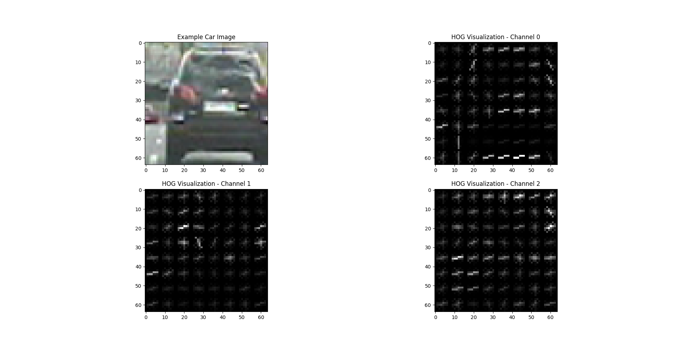

- [Udacity SDC Project 5 - Vehicle Detection and Tracking](#)
  - [Feature Extraction](#feature-extraction)

#Udacity SDC Project 5 - Vehicle Detection and Tracking

In this project for Udacity's Self-Driving Car Nanodegree, an image processing and classification pipeline was implemented in python to detect and track vehicles for highway driving. Given for the project was a video of highway driving from the perspective of a forward facing camera centered on the vehicle. Additionally, a set of labeled images for both vehicles and non-vehicles was provided for classifier training.

The goals / steps of the project were the following:
* Perform a Histogram of Oriented Gradients (HOG) feature extraction on a labeled training set of images and train a classifier Linear SVM classifier.
* Apply a color transform and append binned color features, as well as histograms of color, to the HOG feature vector
* Normalize extracted features and randomize a selection for training and testing.
* Implement a sliding-window technique and use the trained classifier to search for vehicles in images.
* Run the pipeline on a video stream and create a heat map of recurring detections frame by frame to reject outliers and follow detected vehicles.
* Estimate a bounding box for vehicles detected.

##Feature Extraction
A Histogram of Oriented Gradients (HOG) was implemented for feature extraction while training the classifier and searching for vehicles. My implementation utilizes the scikit HOG module. I found the [scikit documentation](http://scikit-image.org/docs/dev/api/skimage.feature.html?highlight=feature%20hog#skimage.feature.hog) and the [tutorial](http://scikit-image.org/docs/dev/auto_examples/features_detection/plot_hog.html) to be extremely useful in understanding HOG and using the module.

There are a few parameters that I spent time tuning to improve HOG feature extraction. These features are:
* Orientations: the number of orientation bins. Final result: 9
* Pixels per cell: the size (in pixels) of a cell. Final result: 8
* Cell per block: Number of cells in each block. Final result: 2
* Color space: Color space of image: Final result: Final result: YCrCb
* HOG channel: Which channel of the image being considered for feature extraction. Final result: All channels

Below are example images of a randomly selected training car image, and a randomly selected not car image. Each channel has been extracted using the `get_hog_features()` function found in the [imageProcessing.py](imageProcessing.py) file. The parameters for feature extraction can be found in the [main.py](main.py) file. The HOG visualization comes from the scikit HOG functions built in visualization output.

Additional feature extraction was implemented using binned color features, as well as histograms of color. Parameters for this include spatial size (final value: (32,32)), and number of histgram bins (final value: 32). This implementation can be found in the `bin_spatial()` and `color_hist()` functions in the [imageProcessing.py](imageProcessing.py) file.

All parameters started at values suggested by Udacity lectures (and in some cases didn't change), but were modified and settled on through experimental analysis.

##Classifier Training
