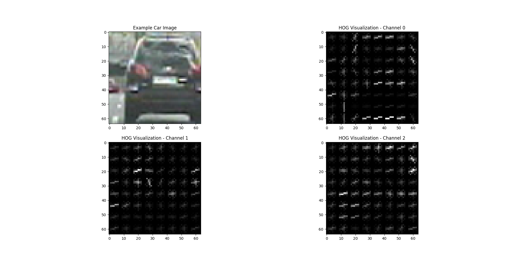
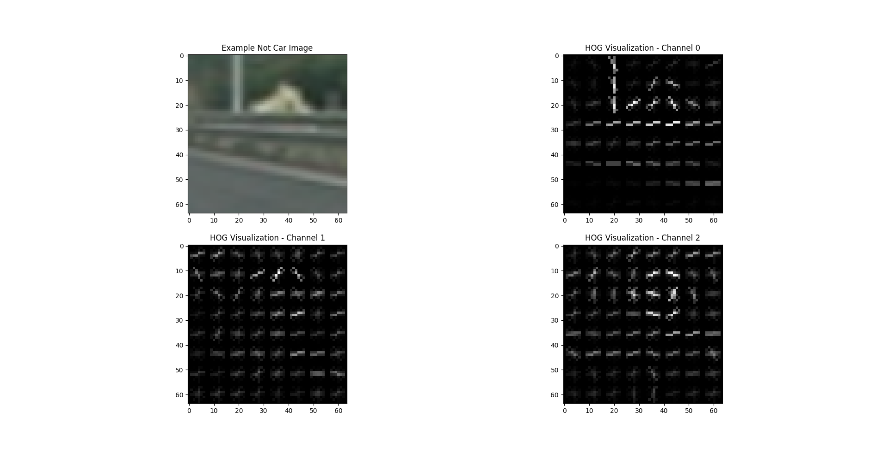
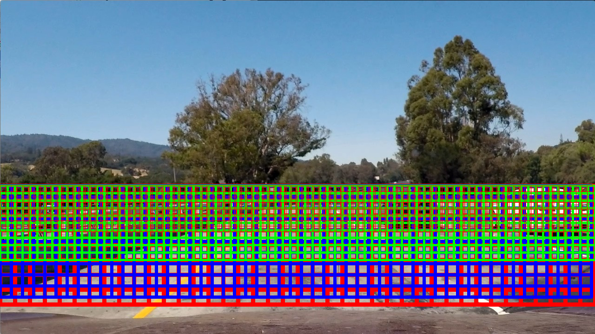
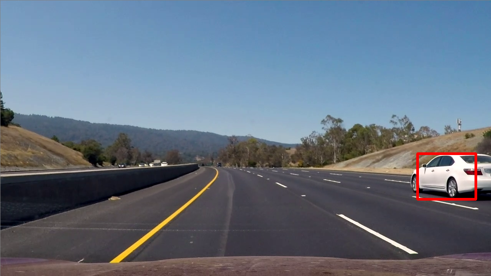
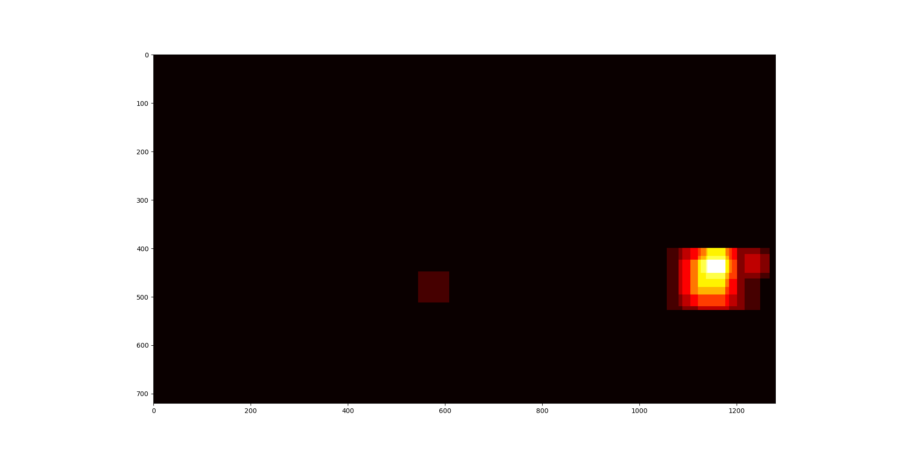

- [Udacity SDC Project 5 - Vehicle Detection and Tracking](#)
  - [Feature Extraction](#feature-extraction)
  - [Classifier Training](#classifier-training)
  - [Sliding Window](#sliding-window)
  - [Video Implementation](#video-implementation)
  - [Filtering False Positives](#filtering-false-positives)
  - [Discussion](#discussion)

# Udacity SDC Project 5 - Vehicle Detection and Tracking

In this project for Udacity's Self-Driving Car Nanodegree, an image processing and classification pipeline was implemented in python to detect and track vehicles for highway driving. Given for the project was a video of highway driving from the perspective of a forward facing camera centered on the vehicle. Additionally, a set of labeled images for both vehicles and non-vehicles was provided for classifier training.

The goals / steps of the project were the following:
* Perform a Histogram of Oriented Gradients (HOG) feature extraction on a labeled training set of images and train a classifier Linear SVM classifier.
* Apply a color transform and append binned color features, as well as histograms of color, to the HOG feature vector
* Normalize extracted features and randomize a selection for training and testing.
* Implement a sliding-window technique and use the trained classifier to search for vehicles in images.
* Run the pipeline on a video stream and create a heat map of recurring detections frame by frame to reject outliers and follow detected vehicles.
* Estimate a bounding box for vehicles detected.

## Feature Extraction
A Histogram of Oriented Gradients (HOG) was implemented for feature extraction while training the classifier and searching for vehicles. My implementation utilizes the scikit HOG module for HOG feature extraction. I found the [scikit documentation](http://scikit-image.org/docs/dev/api/skimage.feature.html?highlight=feature%20hog#skimage.feature.hog) and the [tutorial](http://scikit-image.org/docs/dev/auto_examples/features_detection/plot_hog.html) to be extremely useful in understanding HOG and using the module.

There are a few parameters that I spent time tuning to improve HOG feature extraction. These parameters are:
* Orientations: the number of orientation bins. Final result: 9
* Pixels per cell: the size (in pixels) of a cell. Final result: 8
* Cell per block: Number of cells in each block. Final result: 2
* Color space: Color space of image: Final result: Final result: YCrCb
* HOG channel: Which channel of the image being considered for feature extraction. Final result: All channels

Below are example images of a randomly selected training car image, and a randomly selected not car image. Each channel has been extracted using the `get_hog_features()` function found in the [imageProcessing.py](imageProcessing.py) file. The parameters for feature extraction can be found in the [main.py](main.py) file. The HOG visualization comes from the scikit HOG function's built in visualization output.

Additional feature extraction was implemented using binned color features, as well as histograms of color. Parameters for this include spatial size (final value: (32,32)), and number of histgram bins (final value: 32). This implementation can be found in the `bin_spatial()` and `color_hist()` functions in the [imageProcessing.py](imageProcessing.py) file.

All parameters started at values suggested by Udacity lectures (and in some cases didn't change), but were modified and settled on through experimental analysis.

## Classifier Training
I chose, per Udacity's suggestion, to use a Linear SVM classifier. Scikit was utilized again, specifically the [liner support vector classifier module](http://scikit-learn.org/stable/modules/generated/sklearn.svm.LinearSVC.html#sklearn.svm.LinearSVC) with default parameters. The implementation can be found in the `train_classifier()` function in the [main.py](main.py) file. Additionally, [scikit's standard scalar module](http://scikit-learn.org/stable/modules/generated/sklearn.preprocessing.StandardScaler.html) was utilized to scale the extracted features to zero mean and unit variance.

## Sliding Window
To search for cars using a trained classifier, a sliding window algorithm was implemented that searches specific areas of an image and predicts a binary (car or no car) value for that area. In order to capture vehicles at different ranges with respect to the camera, varying window sizes have been implemented, with smaller windows meant for vehicles further away and larger windows meant for vehicles close to the camera. Additionally, the window "sliding" is less then the full window width and height, resulting in overlapping windows. This is to ensure that the algorithm does not skip over a vehicle that might be in between windows if the window slide was too large.

After some experimentation, four different window sizes were settled on: small 51x51 pixels, medium 64x64 pixels, big 96x96 pixels, and bigger 128x128 pixels. A 75% overlap was used for sliding the windows in both x and y. The image below is a representation of the different sliding windows sizes and overlaps implemented.

It should be noted that generating HOG features takes quite a bit of time, especially when generating HOG features for every window. For this reason, a faster approach was implemented that only needs to generate HOG features once (in the region of interest), and subsamples the HOG features for each specific window location. In order to do this, each image needs to be scaled to properly match the sliding window size being tested.

Code for this implementation can be found in the `find_cars()` function in the [slidingWindow.py](slidingWindow.py) file.

## Video Implementation
[Video output can be found here](output.avi)

## Filtering False Positives
While the classifier does a decent job of identifying vehicles on its own, it also generates a few false positives along the way. In order to filter out these false positives, a heat map was implemented with some simple thresholding that removes the positive if there are less than a specified amount of overlapping windows. This is essentially a naïve way to ensure that the classifier is confident of its classification of a given area in the image.

Below are a couple images that show a final output frame, and its corresponding heat map. Note the slightly cooler sections of the heat map that do not make it past the threshold and into the final output.

The heat map implementation can be found in the [heatMap.py](heatMap.py) file and in the video pipeline in the [main.py](main.py) file.

## Discussion
In this project, an image processing and classification pipeline was implemented in python to detect and track vehicles for highway driving. While the implementation was successful, there are a few issues that should be considered in the future.

The first and foremost issue is the run time of the algorithm. Extracting HOG features is computationally heavy (although I noticed significant changes with parameter tuning) and causes the algorithm to run at a slower than real-time speed. This issue is exasperated when considering many different windows of different sizes. Perhaps a deep learning algorithm would be a better and faster solution.

Another issue in my implementation is the jitteriness of the identified vehicles. While the vehicles are properly identified, some video frames show the generated bounding box to be smaller than the vehicle, or to quickly change size with respect to the previous frame. One possible solution would be to improve my heat map filtering algorithm by smoothing out the bounding boxes by considering the previous X frames.

Finally, the training data used to train the classifier could be considered to be incomplete. It does not contain a very wide range of vehicle types, colors, or shapes, nor does it contain images of partially observable vehicles, a situation that occurs when a vehicle is entering the field of view or is obstructed by another object. I believe (as is generally the case with machine learning) that the addition of more data would drastically improve the classification results.
